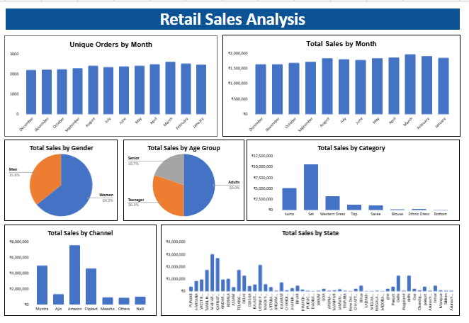

# Retail-Sales-Analysis-in-Google-Sheets

This project is a **retail sales data analysis and visualization dashboard** created entirely in **Google Sheets**. It represents my second project developed under the mentorship of **AI Datayard**, with continuous guidance from **Ma'am Rabbiya**.

The goal was to extract meaningful business insights from raw sales data using spreadsheet formulas and data manipulation — all without using any advanced BI tools.

## 📷 Dashboard Preview

##  Project Overview

* **Tool Used**: Google Sheets
* **Project Type**: Data Cleaning, Analysis, and Visualization
* **Domain**: Retail / E-commerce

##  Objective

The aim was to analyze sales data and create a dynamic, visual dashboard using only Google Sheets, focusing on key business questions and metrics such as customer behavior, product performance, and geographic insights.

##  Dataset Description

The dataset contained the following information:

* Order details (Order ID, Order Date)
* Customer information (Customer ID, Gender, Age)
* Product details (Category, Items Ordered)
* Sales and Quantity
* City/State
* Sales Channels

##  Data Preparation & Cleaning

To enable analysis, the following transformations were applied:

* Extracted **Year, Month, and Weekday** from the order date
* Calculated **Total Price** (`Quantity * Price`)
* Removed unnecessary columns and ensured consistent formatting
* Applied data validation for cleaner reporting

##  Business Questions Answered

Using formulas like `COUNT`, `COUNTIFS`, `SUMIFS`, and `UNIQUE`, I answered the following:

1. **How many orders are there?**
2. **How many unique customers have placed orders?**
3. **Which gender placed the most orders?**
4. **Which gender has a higher customer count?**
5. **What is the primary age group (target audience)?**
6. **Which channel (online/offline) has the highest sales?**
7. **Which product category has the highest revenue?**
8. **How many items have been sold in total?**
9. **Which city/state generated the most sales?**
10. **Which city/state has the most customers?**

##  Dashboard Features

* **Interactive charts** displaying:

  * Orders over time
  * Sales by gender and channel
  * Category-wise performance
  * State/city-wise sales distribution
* **Summary cards** showing total orders, total revenue, most active gender, and top-selling category
* Built entirely with **native Google Sheets functions**

##  Skills Demonstrated

* Spreadsheet formula logic (`COUNTIFS`, `SUMIFS`, `TEXT`, `UNIQUE`, etc.)
* Data cleaning and transformation
* Creating charts and KPIs in Google Sheets
* Business thinking and insight generation
* Dashboard layout and design in spreadsheets

##  Acknowledgments

This project was completed with the valuable support and mentorship of **Ma'am Rabbiya** at **AI Datayard**. Her detailed guidance through each step helped me learn not just the tools, but how to think like an analyst.

##  Author

**Maira Nawaz**

[LinkedIn](https://www.linkedin.com/in/mairanawaz/) | [Kaggle](https://www.kaggle.com/mairanawaz) | [Github](https://github.com/Maira-Nawaz)

